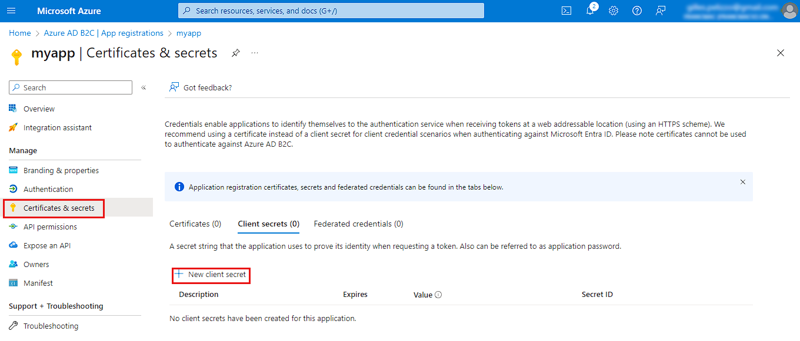

# 1 Install flutter_azure_b2c package
### Official package is available at https://pub.dev/packages/flutter_azure_b2c but an issue does not allow to use it with iOS.
### #alex-dokienko provides a fork supporting TFP for iOS: https://github.com/alex-dokienko/flutter_azure_b2c
### this package is a simple fork of #alex-dokienko one, updating only the intl package version into pubspec.yaml (avoiding  compiling issue with my one app)    

# 2 Azure B2C general settings
## 2.1 Create an Azure Active Directory B2C tenant
https://learn.microsoft.com/en-us/azure/active-directory-b2c/tutorial-create-tenant

## 2.2 Create a new B2C App
### Open Azure AD B2C


### Go to App Registration (consider <AZURE_B2C_DIRECTORY_NAME>)


### and click on New registration


### enter application name and Register


### and copy Application (client) ID (Consider <AZURE_B2C_APP_CLIENT_ID>>)


## 2.3 User flow settings
### Go to Certificats & Secrets and + New client secret


### enter description and set Expires to 730 days (24 months), then click Add


### copy the client secret value (<CLIENT_SECRET_VALUE>)


### Go back to Azure AD B2C and click on Identity providers. Select Microsoft Account.


### Fill a name into Name, copy the <AZURE_B2C_APP_CLIENT_ID> into Client ID and <CLIENT_SECRET_VALUE> into Client Secret. (consider <MICROSOFT_IDP_CALLBACK_URL>), then click Save


### Click on User flow and + New user flow


### Select Sign up and Sign IN  as user flow type and the Recommander version, then click Create


### Fill a name <AZURE_B2C_USER_FLOW_WEB_ANDROID_NAME>, set Local accounts to None, select Microsoft Social identity provider create above, set Type of method to Email, set MFA enforcement to Off, then click Create  


### Restart and create a new user flow <AZURE_B2C_USER_FLOW_IOS_NAME> with the same parameters


### let's consider <AZURE_B2C_USER_FLOW_IOS_NAME> (e.g. B2C_1_IOS) and <AZURE_B2C_USER_FLOW_WEB_ANDROID_NAME> (e.g. B2C_1_WEB_ANDROID)

### For both user flows (<AZURE_B2C_USER_FLOW_WEB_ANDROID_NAME> and AZURE_B2C_USER_FLOW_IOS_NAME), open and click on Application claims. Then enable Email Addresses and save


### For IOs user flow only (<AZURE_B2C_USER_FLOW_IOS_NAME>), click on Properties and go to Token compatibility settings. Select the URL with /tfp/, then save


## 2.4 API settings

### Go back to App settings and click on Expose an API. Then click on Add a scope


### Click on Save and continue without modifying the URI


### Fill 'read' as name, display name and description, then click on Add scope


### Copy the scope URI(<AZURE_B2C_EXPOSED_API_URI>)


### Click on API permission and + Add a permission


### Select Microsoft APIs and click on Microsoft Graph


### Click on Application permissions


### Enable Application.Read.All into Application scope, then Add permissions


### Add a new permission and click on APIs my organization uses. Then click ok the App name


### Into Delegated permissions, enable read permission, then click on Add permissions


### click on Grant admin consent


# 3 Azure B2C Web authentifications settings

### Click on Authentication and + Add a platform


### Click on WEB


### Fill Redirect URIs with <MICROSFT_IDP_CALLBACK_URL> obtained before. Enable Acces token and ID tokens, then click on Configure. 


### Add a new platform and select Single-page application


### Fill Redirects URIs with application URI (localhost host is supported for testing). Then click on Configure


# 4 Azure B2C Android authentifications settings
## 4.1 Obtain signature hash base64
### on FLutter, move to \android subfolder and type ./gradlew signinReport


### Copy SHA1 hex signature


### Go to https://base64.guru/converter/encode/hex to convert signature du base64 and consider <SIGNATURE_HASH_BASE64>


## 4.2 Create Android authentication
### Go back to Authentication menu, Click on + Add a platform


### Fill Package name with the Android App package Name <ANDROID_APP_PACAKE_NAME> (available into android/app/build.gradle, cf namespace) and copy <SIGNATURE_HASH_BASE64> create above into Signature hash. Then click on Configure and Done.


### Copy <AZURE_B2C_ANDROID_REDIRECT_URI>


# 5 Azure B2C iOS authentifications settings
## 5.1 Create iOS authentication
### Go back to Authentication menu, Click on + Add a platform


### Fill Bundle ID with <IOS_BUNDLE_ID> (cf ......), then click on Configure and Done


### Copy <AZURE_B2C_IOS_REDIRECT_URI>


# 6 Flutter Azure B2C settings
## 6.1 iOS settings
### 6.1.1 Create azure_auth_config.json config file and save it into ios/Resources (create directory if necessary)

``` 
{
    "client_id" : "<AZURE_B2C_APP_CLIENT_ID>",
    "redirect_uri" : "<AZURE_B2C_IOS_REDIRECT_URI>",  /*something like msauth.<IOS_BUNDLE_ID>://auth"*/
    "account_mode" : "MULTIPLE",
    "broker_redirect_uri_registered": false,
    "authorities": [
      {
          "type": "B2C",
          "authority_url": "https://<AZURE_B2C_DIRECTORY_NAME>.b2clogin.com/tfp/<AZURE_B2C_DIRECTORY_NAME>.onmicrosoft.com/<AZURE_B2C_USER_FLOW_IOS_NAME>/",
          "default": true
      }
    ],
    "default_scopes": [
        "<AZURE_B2C_EXPOSED_API_URI>"
    ]
}
``` 

### 6.1.2 Add new keychain Group into xCode project
#### Open xCode project, go to Signing & Capabilities, add capability and select Keychain Groups. Then add com.microsoft.adalcache on iOS (and com.microsoft.identity.universalstorage on MacOS).


### 6.1.3 Automatic copy azure_auth_config.json before building
#### On xCode, go to Build Phases and under Copy Bundle Resources, add azure_auth_config.json file


### 6.1.4 Update Info.plist
#### Open Info.plist and insert following line inside <key>CFBundleURLTypes</key> array (replace <IOS_BUNDLE_ID>)

```  
<key>CFBundleURLTypes</key>
    <array>
        ....
        <dict>
            <key>CFBundleURLSchemes</key>
            <array>
                <string>msauth.<IOS_BUNDLE_ID>></string>
            </array>
        </dict>
</array>
```

#### add also following lines somewhere else
```
<key>LSApplicationQueriesSchemes</key>
<array>
    <string>msauthv2</string>
    <string>msauthv3</string>
</array>
```

### 6.1.5 Update AppDelegate.swift file
#### Add import MASL and add function below without deleting the previous one

```
import MSAL

....

override func application(
    _ app: UIApplication, 
    open url: URL, 
    options: [UIApplication.OpenURLOptionsKey : Any] = [:]) -> Bool {
        guard let sourceApplication = options[UIApplication.OpenURLOptionsKey.sourceApplication] as? String else {
            return false
        }  
   
    return MSALPublicClientApplication.handleMSALResponse(url, sourceApplication: sourceApplication)
  }
```

## 6.2 Android settings
### 6.2.1 Configure app to use the INTERNET and ACCESS_NETWORK_STATE
#### Open android/app/src/main/AndroidManifest.xml and copy following line into manifest

```
    <manifest xmlns:android="http://schemas.android.com/apk/res/android">
        <uses-permission android:name="android.permission.INTERNET" />
        <uses-permission android:name="android.permission.ACCESS_NETWORK_STATE"/>
        .....
```

#### and into <application>, add following activity and filter

```
    <activity android:name="com.microsoft.identity.client.BrowserTabActivity">
        <intent-filter>
            <action android:name="android.intent.action.VIEW" />
            <category android:name="android.intent.category.DEFAULT" />
            <category android:name="android.intent.category.BROWSABLE" />
            <data android:scheme="msauth" android:host = "<ANDROID_APP_PACKAGE_NAME>" android:path = "/<SIGNATURE_HASH_BASE64>" />
        </intent-filter>
    </activity>
```

### 6.2.2 Create azure_auth_config.json config file and save it into android/app/src/main/res/raw (create directory if necessary)

```
{
    "client_id" : "<AZURE_B2C_APP_CLIENT_ID>",
    "redirect_uri" : "<AZURE_B2C_ANDROID_REDIRECT_URI>", /*something like "msauth://<ANDROID_APP_PACKAGE_NAME>/<SIGNATURE_HASH_BASE64_URL_ENCODES>"*/
    "account_mode" : "MULTIPLE",
    "broker_redirect_uri_registered": false,
    "authorities": [
      {
          "type": "B2C",
          "authority_url": "https://<AZURE_B2C_DIRECTORY_NAME>.b2clogin.com/<AZURE_B2C_DIRECTORY_NAME>.onmicrosoft.com/<AZURE_B2C_USER_FLOW_WEB_ANDROID_NAME>/",
          "default": true
      }
    ],
    "default_scopes": [
        "<AZURE_B2C_EXPOSED_API_URI>"
    ]
}
```

## 6.3 Web settings
#### 6.3.1 Open web/index.html and add following line

```
<script type="text/javascript" src="https://alcdn.msauth.net/browser/2.14.0/js/msal-browser.min.js"></script>
```

#### 6.3.2 Create azure_auth_config.json config file and save it into assets

```
{
    "client_id" : "<AZURE_B2C_APP_CLIENT_ID>,
    "redirect_uri" : <WEB APP URL>, /*something like "http://localhost:53537" or any other URL "https://mywebsite"*/
    "cache_location": "sessionStorage",
    "interaction_mode": "popup",
    "authorities": [
      {
          "type": "B2C",
          "authority_url": "https://<AZURE_B2C_DIRECTORY_NAME>.b2clogin.com/<AZURE_B2C_DIRECTORY_NAME>.onmicrosoft.com/<AZURE_B2C_USER_FLOW_WEB_ANDROID_NAME>/,
          "default": true
      }
    ],
    "default_scopes": [
        "<AZURE_B2C_EXPOSED_API_URI>"
    ]
  }


```